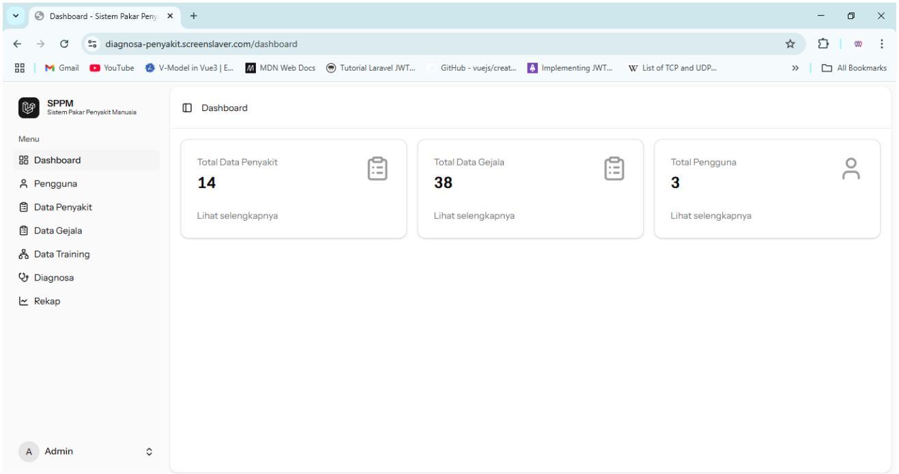
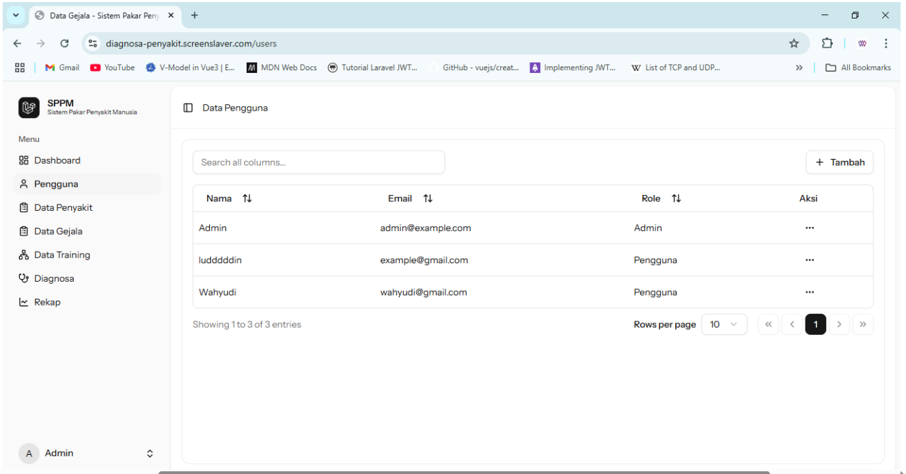
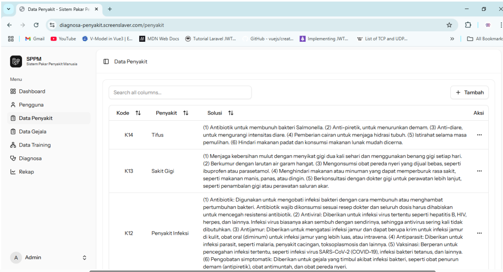
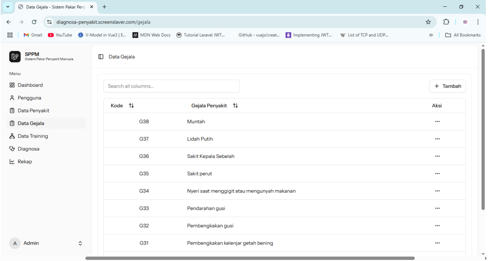
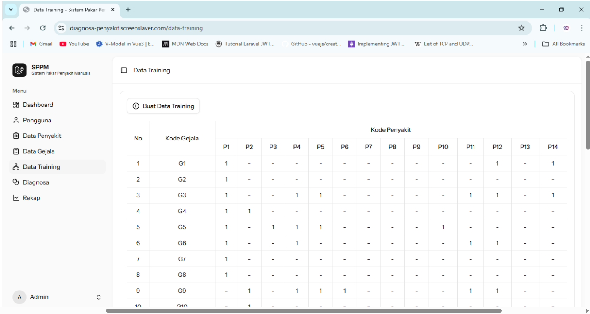
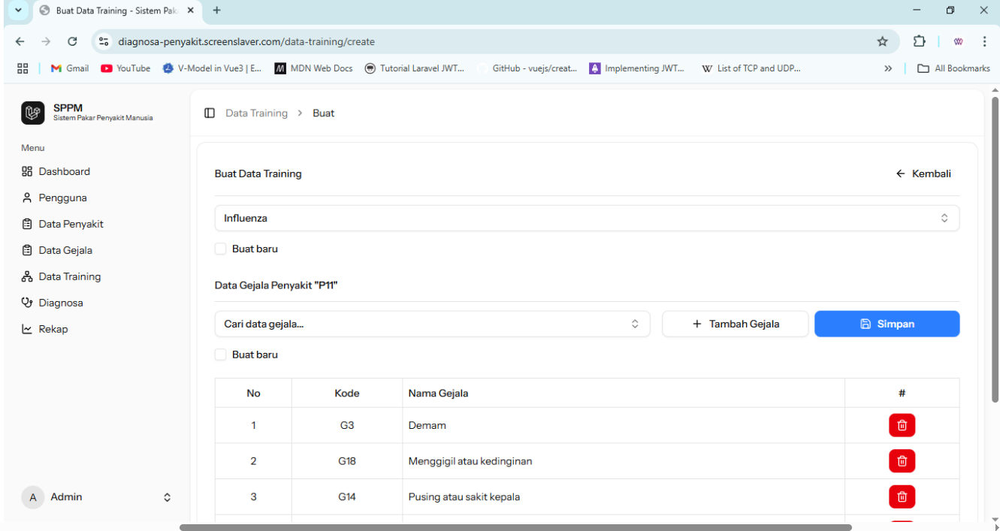
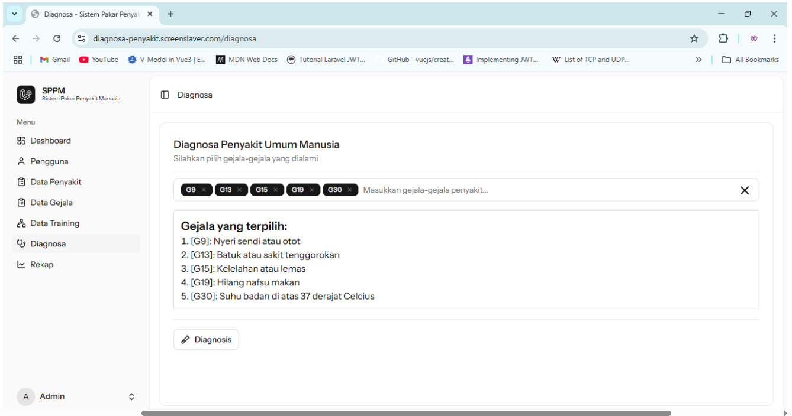
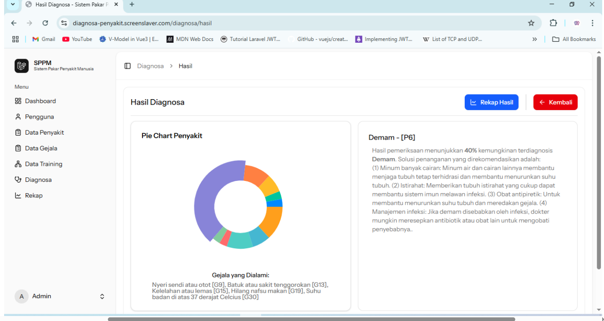
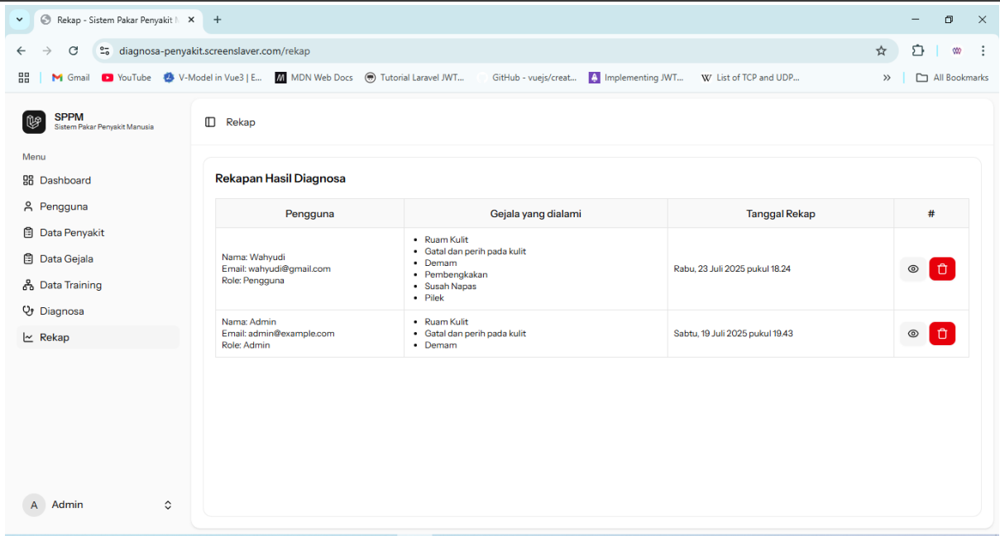

# Sistem Diagnosa Penyakit
Sistem Diagnosa Penyakit Umum Manusia dengan Algoritma Naive Bayes” merupakan sebuah aplikasi berbasis komputer yang dirancang untuk membantu pengguna dalam mengidentifikasi kemungkinan penyakit berdasarkan gejala yang dialami. Sistem ini memanfaatkan metode klasifikasi dari bidang Machine Learning, khususnya algoritma Naive Bayes, yang bekerja dengan menghitung probabilitas kemunculan suatu penyakit berdasarkan data gejala yang dimasukkan.

Pengguna dapat memilih atau memasukkan gejala yang dirasakan, kemudian sistem akan memproses data tersebut dengan membandingkannya terhadap basis pengetahuan yang telah dilatih sebelumnya. Hasilnya berupa daftar kemungkinan penyakit beserta tingkat probabilitasnya, sehingga dapat memberikan gambaran awal sebelum melakukan pemeriksaan lebih lanjut ke tenaga medis profesional.

Sistem ini bertujuan untuk meningkatkan kesadaran kesehatan masyarakat, memberikan informasi awal yang cepat dan akurat, serta menjadi alat bantu dalam pengambilan keputusan terkait kondisi kesehatan. Meskipun demikian, hasil dari sistem ini tidak menggantikan diagnosis dokter, melainkan hanya sebagai pendukung dalam proses identifikasi penyakit.

## Dashboard

## Halaman Data Pengguna

## Halaman Data Penyakit

## Halaman Data Gejala

## Halaman Training

## Membuat Data Training

## Halaman Diagnosa

## Hasil Diagnosa

## Rekap
